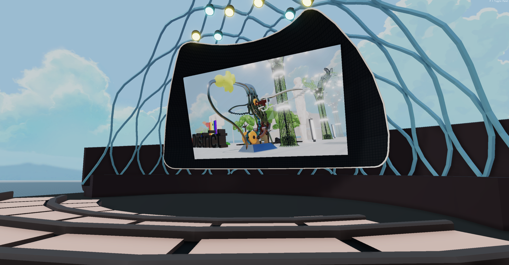

# Video Streaming

A simple scene with a video screen that loops a video that was uploaded to Vimeo.



This scene shows you:

- How to stream videos from an external source
- How to configure the properties of a material for the best image clarity on a video

## Try it out

**Install the CLI**

Download and install the Decentraland CLI by running the following command:

```bash
npm i -g decentraland
```

**Previewing the scene**

Download this example and navigate to its directory, then run:

```
$:  dcl start
```

Any dependencies are installed and then the CLI opens the scene in a new browser tab.

Learn more about how to build your own scenes in our [documentation](https://docs.decentraland.org/) site.

# Setting up the Server for Streaming

### _NOTE: These are just brief notes from my meeting with HPrivakos (will tidy up later...)_

## Choosing a hosting option

The simplest option for streaming video is to use a Vimeo paid account. You can also go for a Vimeo _premium_ account, which is significantly more expensive but enables more options. The other recommended alternative is to set up your own server, using free software but paying for hosting on a platform like Digital Ocean. All these options have pros and cons for different scenarios. You should evaluate what's best for you taking into account your needs, technical skills and budget.

**Vimeo Plus (or higher)**:

Pors:

- Should be able to support unlimited concurrent users
- Is extremely easy to set up
- Costs $7 USD a month
- Offers analytics dashboard

Cons:

- Only allows you to stream pre-loaded videos, **no live streaming**.
- In this modality, players see the video start when each arrives to the scene. What they see may be out of sync with each other.

**Vimeo Premium**

Pros:

- Should be able to support unlimited concurrent users
- Is extremely easy to set up
- Allows for **live streaming**
- Offers analytics dashboard

Cons:

- Costs $75 usd a month

**Set up own server on Digital Ocean**

Pros:

- You can do streaming or **any modality** you want
- Can cost as little as $5 USD a month (this option supports up to roughly 50 viewers)
- Relatively nice UI, if you have a strong technical background

Cons:

- Requires high technical skills to set up everything manually
- The cheap option is not recommended for +50 viewers, more expensive options may be on par with Vimeo Premium.

> Note: For many Decentraland Foundation events, we use Amazon Web Services hosting. This option is more robust, but also more expensive and less friendly to set up.

## Set up Vimeo Plus

This is the simplest option, but doesn't allow for live streaming.

1. Create a Vimeo account if you don't have one. Then upgrade to any of the [paid tiers](https://vimeo.com/upgrade) offered there.

2. Upload a video to one of your folders.

3. Open the video's settings, and select **Advanced**.

4. Pick **Distribution**, and scroll to the bottom to Video file links. Copy the last one of these links, the one labeled **HTTP live streaming**.

> Note: The other available links on specific resoltuions often don't work when streamed into Decentraland. Always use the **HTTP Live streaming**. This option adjusts the quality of the video dynamically depending on the player's connection, leading to an optimal result. Note that this link is different from performing a streaming of a live event: players will each see the video from start to finish, without necessarily being in sync with what each other is seeing. 

5. Paste the link into your scene, replacing the placeholder on the `VideoClip` object.

> Tip: If you intend your video to loop, make sure you set the `loop` property on the `VideoTexture` in your scene. Otherwise the video will play just once for each player.

<!--
## Set up Vimeo Premium

This is the most powerful option, but is significantly more expensive than the others.

1. Create a Vimeo account if you don't have one. Then upgrade to the [**Premium**](https://vimeo.com/upgrade) tier.


...Additional steps to be confirmed
-->

## Custom Server on Digital Ocean (Advanced)

This is the cheapest option, but is significantly harder to set up than the others.

See [ADVANCED-SETUP.md](https://github.com/decentraland-scenes/video-streaming/blob/master/AVDANCED-SETUP.md) for detailed instructions for how to deploy a server, configure it, and install all the necessary command-line tools.
